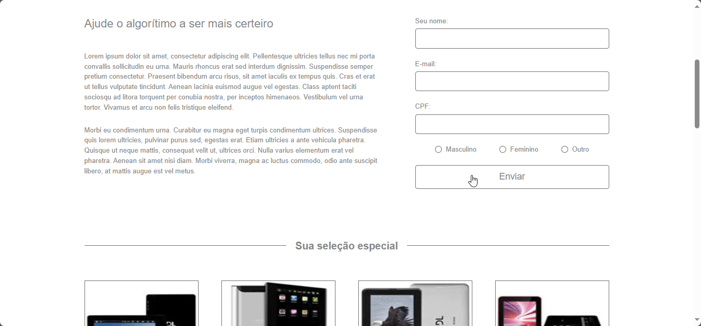

# Landing Page Challenge - Formação Full Stack Javascript

This is a solution for the landing page challenge on the Formação Full Stack Javascript course. It displays a landing page with a newsletter form and a product section.

## Table of contents

- [Overview](#overview)
  - [The challenge](#the-challenge)
    - [Design](#design)
    - [Page Behavior](#page-behavior)
    - [Challenge Evaluation Criteria](#challenge-evaluation-criteria)
  - [Screenshot](#screenshot)
    - [Mobile](#mobile)
    - [Desktop](#mobile)
  - [Links](#links)
- [Setup](#setup)
- [My process](#my-process)
  - [Built with](#built-with)
  - [What I learned](#what-i-learned)
  - [Continued development](#continued-development)
  - [Useful resources](#useful-resources)
- [Author](#author)

## Overview

### The challenge

The challenge consists on developing a landing page containing a product grid and a newsletter form. you can find the original challenge instructions [here](https://github.com/thiagocontaparatestes/testes-vaga-emprego/blob/main/teste-html-css-js.md). For practical reasons, I have summarized the rules of the challenge below.

#### Design

The implemented design must be according to the following mock:

- [Layout Mock Link](https://xd.adobe.com/spec/4025e242-a495-4594-71d2-5fd89d774b57-3614)

#### Page Behavior

- [API Endpoint Link](https://frontend-intern-challenge-api.iurykrieger.now.sh/products?page=1)

  - Each page of the API return 8 product infos and a link to the next page.
  - For each product, a card must be presented on the products section grid.
  - By clicking on the "Ainda Mais Produtos Aqui!" button the eight products of the next page must be added after the first eight loaded.
- Input fields on the forms must be validated according to their content (Ex: e-mail must be valid e-mail address).

#### Challenge Evaluation Criteria

- HTML, CSS and JavaScript only!
- Significant commits
- System architecture and organization
- Knowledge of responsiveness
- Modularity and reusability
- Good programming practices

### Screenshot

#### Mobile

#### Desktop

### Links

- Solution URL: [Github repository](https://github.com/jefersonBorges/ffjs-landing-page-challenge)
- Live Site URL: [Github live page](https://jefersonborges.github.io/ffjs-landing-page-challenge/)

## Setup

To run this project, simply download the files and open the "index.html" file with your internet browser, or click on the [live site url](https://jefersonborges.github.io/ffjs-landing-page-challenge/).

## My process

### Built with

- HTML semantic Markup
- CSS
  - Mobile-first
  - Flexbox
  - Grid
- Javascript
  - OOP
  - ES6 Features
  - Async
  - Event Handling
  - DOM
  - Client-side form validation

### What I learned

- CSS Grid auto-fit and image aspect-ratio [Learn how to create a responsive CSS grid layout](https://www.youtube.com/watch?v=sKFW3wek21Q)

- Client-side Form validation [Client-side form validation](https://developer.mozilla.org/en-US/docs/Learn/Forms/Form_validation)

- [HTML Form Element](https://developer.mozilla.org/en-US/docs/Web/API/HTMLFormElement)

### Continued development

### Useful resources

## Author

- GitHub - [jefersonBorges](https://github.com/jefersonBorges/jefersonBorges)
- Frontend Mentor - [@jefersonBorges](https://www.frontendmentor.io/profile/jefersonBorges)
- Linkedin - [Jeferson Borges Linkedin](https://www.linkedin.com/in/jeferson-borges-543b34229)

---
